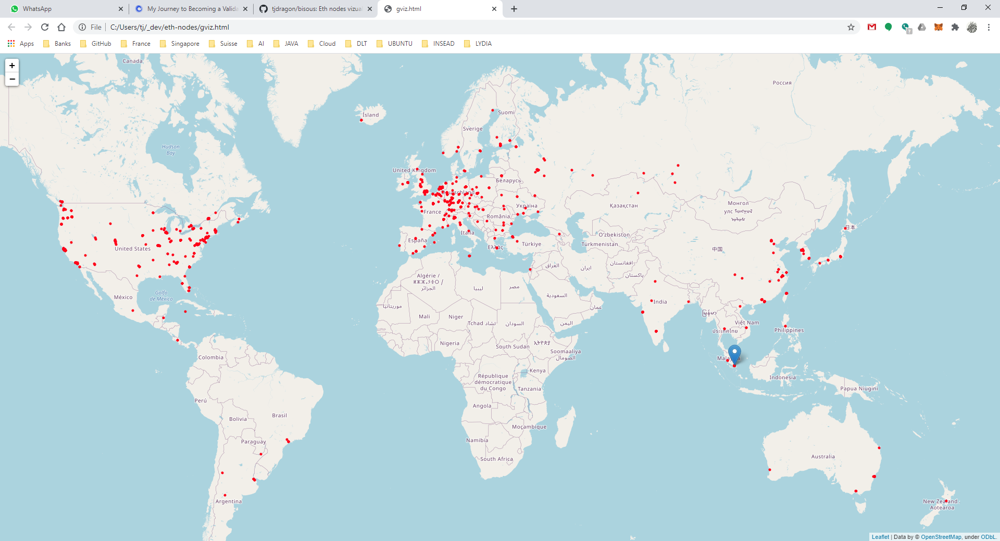

# bisous
Eth nodes vizualisation.



## Besu
Download Besu from [https://github.com/hyperledger/besu](https://github.com/hyperledger/besu).  
Modify the class **PeerDiscoveryController** to save the peers IP addresses (method addToPeerTable).  
Run the local node and wait for a while.  
I waited 30 minutes to get ~2,000 IPs.

## ipstack
Get an API key from [https://ipstack.com/](https://ipstack.com/).  
Convert the IPs into longitude and latitude.  

```python
import requests
import time

end_point = "http://api.ipstack.com/"
suffix = "?access_key=YOUR_ACCES_KEY_HERE&format=1"

ipsf = open('ips.csv', 'r') 
outF = open("ipsll.csv", "w")
lines = ipsf.readlines() 
outF.write("c1, c2, c3, c4\n")

for line in lines: 
    start = time.time()
    ip = line.strip()
    url = end_point + ip + suffix
    response = requests.get(url)
    data = response.json()
    lat = data['latitude']
    lon = data['longitude']
    end = time.time()
    print("IP ", ip, lat, lon, (end-start))
    line = str(ip) + ", " + str(lat) + ", " + str(lon) + ", " +  str((end-start)) + "\n"
    outF.write(line)
    outF.flush()

outF.close()
print("Bye")
```

## Folium
In a Jupyter notebook, draw the coordinates.  
I used [Folium](https://python-visualization.github.io/folium/modules.html#module-folium.vector_layers)

```python
import folium
import pandas as pd 
from colour import Color

trackpoints = pd.read_csv("ipsll.csv", sep=r'\s*,\s*', engine='python') 

map = folium.Map(location=[1.3521, 103.8198])
folium.Marker(location=[1.3521, 103.8198], popup='SG').add_to(map)

for index, row in trackpoints.iterrows():
    lat = row['c2']
    lon = row['c3']
    if not pd.isna(lat):
        folium.CircleMarker(location=(lat, lon),
                            radius = 1,
                            color='red',
                            popup="Start",
                            fill=False).add_to(map)   
        

map.save('gviz.html')
map
```

Voila.